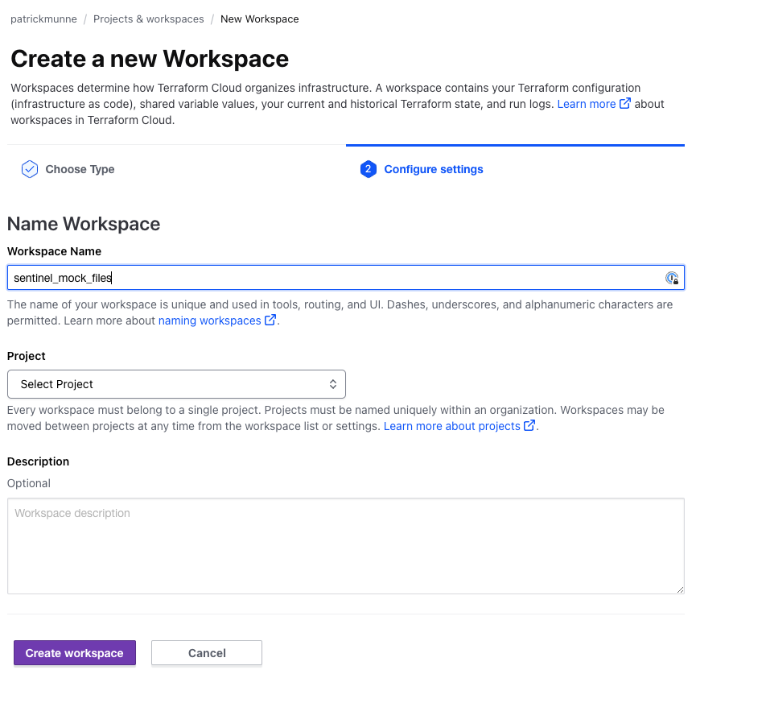
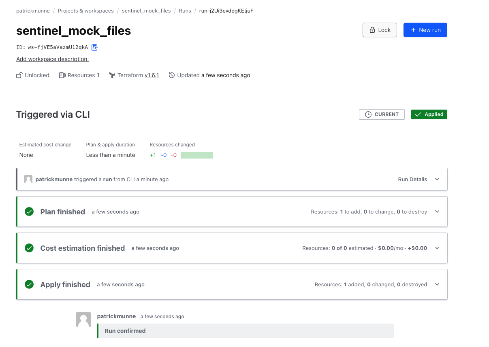
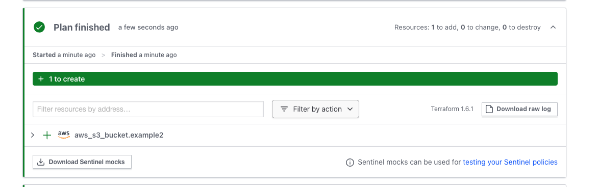

# Sentinel test with mockfiles 

With this repository we are testing sentinel with mockfiles. This is inspired by the following online tutorial

https://developer.hashicorp.com/terraform/tutorials/policy/sentinel-install

# Prerequisites

## Install terraform  
See the following documentation [How to install Terraform](https://learn.hashicorp.com/tutorials/terraform/install-cli)

## install sentinel
Download an install sentinel CLI tool from [here](https://docs.hashicorp.com/sentinel/downloads)

## TFE/TFC environment
Access to a TFE/TFC environment with admin permissions to create policy set and new workspace. 

# How to

## Configuring and using the policy

- Fork this repository to your own environment
- Clone it to your local machine. Change the url to your own repo
```
git clone https://github.com/munnep/sentinel_template.git
```
- Login to your TFE environment
- Create a new ClI driven workspace where we can execute the terraform code so we have mockfiles available
  
- update the file `terraform_code/main.tf` and alter the terraform code to reflect your TFE/TFC environment
```
terraform {
  cloud {
    organization = "patrickmunne"

    workspaces {
      name = "sentinel_mock_files"
    }
  }
}
```

- Execute the code to create a bucket with tags on it
```
terraform init
terraform apply
```
  
- Go to the run in your TFE/TFC environment and click on the plan 
  
- Download the sentinel mocks
- unzip these into the the directory `mock-data`. Output should be like below
```
mock-data
├── README.md
├── mock-tfconfig-v2.sentinel
├── mock-tfconfig.sentinel
├── mock-tfplan-v2.sentinel
├── mock-tfplan.sentinel
├── mock-tfrun.sentinel
├── mock-tfstate-v2.sentinel
├── mock-tfstate.sentinel
└── sentinel.hcl
```
- Now you have the mock-files and you can test the sentinel policy you have. Look at the contents of the `restrict-s3-buckets.sentinel` and `sentinel.hcl` files
- Do a test like the following
```sh
sentinel apply -trace restrict-s3-buckets.sentinel
```
- This should pass as you have created the bucket with tags
```hcl
Pass - restrict-s3-buckets.sentinel

restrict-s3-buckets.sentinel:14:1 - Rule "main"
  Value:
    true

restrict-s3-buckets.sentinel:8:1 - Rule "bucket_tags"
  Value:
    true
```
- Change the sentinel policy to verify there shouldn't be a tag on it and test again. Alter the file `restrict-s3-buckets.sentinel`

change this:
```hcl
bucket_tags = rule {
	all s3_buckets as _, instances {
		instances.change.after.tags is not null
	}
}
```

to this
```hcl
bucket_tags = rule {
	all s3_buckets as _, instances {
		instances.change.after.tags is null
	}
}
```
- Do another `sentinel apply` and it should fail as we have tags 
```
sentinel apply -trace restrict-s3-buckets.sentinel
```
output:
```
Fail - restrict-s3-buckets.sentinel

restrict-s3-buckets.sentinel:14:1 - Rule "main"
  Value:
    false

restrict-s3-buckets.sentinel:8:1 - Rule "bucket_tags"
  Value:
    false
```